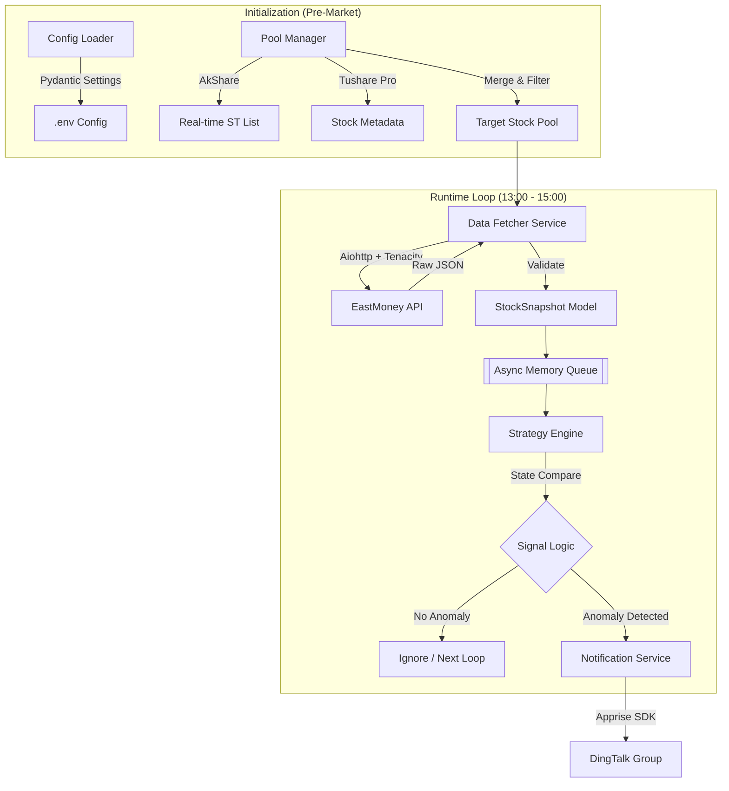

# Project Gutao_Chaodi: A股下午盘异动监控机器人系统架构与开发白皮书

> 状态说明（2026-02-20）  
> 本文档是“初版设计白皮书”，部分内容已与当前代码实现产生偏差。  
> 当前落地实现请以 `doc/Project_Architecture_Guide.md`、`doc/Project_Memory.md`、`doc/worklog/2026-02-20_current_framework_status.md` 为准。

## 0. 现状对齐摘要（As-Built Delta）

| 主题 | 白皮书原始设想 | 当前实现（2026-02-20） |
| --- | --- | --- |
| 回测判定内核 | 回测与实盘复用盘口异动逻辑（`ask_v1`） | 回测已切换为 buy-flow 分钟策略：一字跌停分钟使用 `volume` 代理买量，按“当前分钟 > 前序全天累计”触发。 |
| 回测数据字段 | 假定可稳定获取 `ask_v1/a1_v` | 免费 JoinQuant 分钟回测路径不依赖 `ask_v1`，仅依赖 `close/high/low_limit/pre_close/volume`。 |
| 回测参数 | 阈值、组合关系、代理模式 | 当前 CLI 仅保留日期/代码/数据源/账号/窗口参数，旧参数已退出主路径。 |
| 策略一致性约束 | 实盘与回测同一引擎 | 当前允许分叉：实盘继续 `StrategyEngine`，回测使用独立 runner。 |
| Producer-Consumer 内存队列 | 规划显式队列解耦 | 当前实盘主循环内直接处理；未单独实现显式队列组件。 |

---
## 1. 项目概览 (Executive Summary)

### 1.1 业务背景

本项目旨在构建一套高频自动化监控系统，针对 A 股市场中的 “跌停板下午盘翘板” (Limit-Down Open at Tail) 交易策略进行实时信号捕捉。策略核心逻辑为：监控 T 日下午盘（13:00 - 15:00）跌停股封单的急剧变化（主力撤单或买入），以捕捉 T+1 日集合竞价的高溢价机会。

### 1.2 系统目标

* 低延迟 (Low Latency): 在下午盘 2 小时完整交易时段内，保持对目标股票池的秒级轮询，确保长周期运行无积压。
* 高可用 (High Availability): 具备网络抖动自动重试机制，并针对 2 小时长时运行优化内存管理（GC调优），防止内存泄漏导致的进程崩溃。
* 低噪性 (Low Noise): 引入“信号防抖与静默机制” (Debounce & Silence)，针对盘中反复“跌停-开板-跌停”的拉锯个股，一旦开板并提醒过后，不在看作一字跌停，不在进行追踪，避免重复发送无效报警。

---

## 2. 技术架构与选型论证 (Technology Stack)

为提升开发效率并确保系统健壮性，本项目严格遵循“避免重复造轮子”原则，引入成熟开源框架。以下是核心技术组件的选型决策矩阵。

### 2.1 核心组件决策表

| 架构层级 | 功能模块 | 选型方案 | 原始方案 (手动) | 引入理由与核心价值 |
| --- | --- | --- | --- | --- |
| 数据接入层 | 实时 ST 列表 | AkShare | 手写爬虫解析网页 | 接口稳定性: 封装了交易所/东方财富接口，直接返回清洗后的 DataFrame，无需维护爬虫反爬逻辑。 |
| 数据接入层 | 基础元数据 | Tushare Pro | (同上) | 数据标准化: 即使 Tushare 实时性稍弱，但其提供的上市日期 (`list_date`) 等静态数据最为规范，用于过滤新股。 |
| 网络层 | 高并发请求 | Aiohttp | `Requests` (同步) | 异步 I/O: 利用 Python `asyncio` 协程机制，实现单线程下的非阻塞高并发，满足秒级扫描 100+ 标的需求。 |
| 容错层 | 网络重试 | Tenacity | `try-except-sleep` | 弹性恢复: 提供声明式的重试装饰器（指数退避算法），优雅处理网络超时和接口限流，代码零侵入。 |
| 领域模型层 | 数据校验 | Pydantic | 原生 Dict | 契约精神: 强制定义数据输入输出格式，自动处理类型转换（如将 "-" 转为 0），防止脏数据污染策略逻辑。 |
| 基础设施 | 配置管理 | Pydantic Settings | `os.environ` | 环境隔离: 支持 `.env` 文件加载，实现开发/生产环境配置分离，不仅读取配置，还负责校验配置是否存在。 |
| 可观测性 | 结构化日志 | Loguru | `print` + `colorama` | 运维友好: 自动实现日志轮转（Rotation）、保留策略（Retention）和异常堆栈追踪，无需配置复杂的 Standard Logging。 |
| 通知网关 | 消息推送 | Apprise | `requests.post` | 统一接口: 聚合了 80+ 种通知服务（钉钉、邮件），解耦具体的推送实现，未来更换通知渠道无需修改核心代码。 |

---

## 3. 总体架构设计 (System Architecture)

系统采用 “生产者-消费者” (Producer-Consumer) 微内核架构，通过内存队列实现解耦。



---

## 4. 详细模块设计与实施规范

### 4.1 模块 A：配置与环境管理 (Infrastructure)

* 功能: 统一管理 API Token、阈值参数、Webhook 地址。
* 依赖框架: `pydantic-settings`
* 设计规范: 禁止在代码中硬编码任何密钥或参数。
* 实施说明:
通过定义 `Settings` 类，系统启动时会自动读取 `.env` 文件。如果缺少关键配置（如 Tushare Token），程序将直接报错启动失败，实现 Fail-fast。

```python
# 示例：通过类型注解强制规范配置格式
class Settings(BaseSettings):
    TUSHARE_TOKEN: str
    DINGTALK_URL: str
    VOL_DROP_THRESHOLD: float = 0.2  # 默认 20%
    
    class Config:
        env_file = ".env"

```

### 4.2 模块 B：股票池构建 (Pool Manager)

* 功能: 每日开盘前生成当天的监控目标列表。
* 依赖框架: `AkShare` (主), `Tushare` (辅), `Pandas`
* 数据融合逻辑:
1. 调用 `ak.stock_zh_a_st_em()` 获取全市场实时 ST 股（AkShare 优势：实时性强，包含代码、名称、现价）。
2. 调用 `ts.pro_api().stock_basic()` 获取上市日期（Tushare 优势：静态数据准确）。
3. 利用 `Pandas` 进行 Inner Join，并执行过滤规则（上市 > 1年，非退市整理期）。

### 4.3 模块 C：抗网络抖动的数据采集 (Robust Fetcher)

* 功能: 在 13:00 - 15:00 期间持续获取实时盘口快照。
* 依赖框架: `aiohttp` (Client), `tenacity` (Retry)
* 设计规范:
* 并发控制: 使用 asyncio.Semaphore 严格限制同一时刻的并发请求数（建议限制在 50 以内），防止因请求过快触发 IP 封禁。
* 重试机制: 使用 @retry 装饰器包裹底层请求函数，实现代码零侵入的异常恢复。
* 动态波特率 (Jitter): 在每次请求间隔中引入随机抖动（如 sleep(0.1 + random(0.5))），模拟人类行为，避免固定频率的机器特征。
* 连接池复用: 显式配置 TCPConnector(limit=100, keepalive_timeout=60)，复用 TCP 连接，降低握手开销并减少服务器端并发压力。


* 实施说明:
不需要在业务逻辑中编写 `try...except ConnectionError...sleep`。Tenacity 会自动处理：如果是网络超时，等待 0.5s 后重试；重试 3 次失败后抛出异常供上层记录。

```python
# 示例：分离重试逻辑与流控逻辑

# 1. 纯净的请求函数（负责重试）
@retry(stop=stop_after_attempt(3), wait=wait_fixed(0.5))
async def _fetch_raw(session, url):
    async with session.get(url) as resp:
        return await resp.json()

# 2. 带流控的工作流（负责防抖与并发控制）
async def fetch_worker(sem, session, url):
    async with sem:  # 限制并发数
        # 引入随机抖动，模拟人类行为
        await asyncio.sleep(uniform(0.1, 0.5)) 
        return await _fetch_raw(session, url)
```

### 4.4 模块 D：领域数据模型 (Domain Model)
* 功能: 数据清洗与标准化。
* 依赖框架: `Pydantic`
* 设计规范: 所有流入策略引擎的数据必须是 `StockSnapshot` 对象，严禁传递原生 Dict。
* 实施说明:
API 返回的封单量可能是 `"-"` (表示无挂单) 或空字符串。Pydantic 的 `validator` 负责将其清洗为 `0` (int)，确保下游策略计算 `delta = vol_1 - vol_2` 时不会报错。

### 4.5 模块 E：通知网关与状态熔断 (Notification & Circuit Breaker)

* 功能: 负责消息分发及策略生命周期管理。
* 依赖框架: `Apprise`
* 设计规范:
* 单次触发机制 (One-Shot Trigger): 鉴于“一字跌停”策略的特殊性，任何标的在当日全时段内仅允许触发一次报警。
* 状态熔断 (State Melting): 系统需维护一个“已处理集合” (`processed_set`)。一旦某只股票触发“封单剧减”报警，立即将其加入该集合。在后续轮询中，系统将直接忽略该股，无论其是否回封，彻底杜绝重复骚扰。

* 实施说明:
无需复杂的定时器，只需维护一个内存集合。

```python
# 示例：单次触发逻辑
processed_stocks = set()

```

---

## 5. 数据治理与策略验证 (Data Strategy & Validation)

由于本策略依赖 Level-1 盘口委托量 (Order Book Ask Volume) 的瞬时变化，常规 K 线数据无法支撑回测。鉴于本地维护 TB 级历史 Tick 数据成本过高，本项目采用 “云端回测 + 本地实盘” 的双轨制研发模式。

### 5.1 历史策略验证 (Cloud Backtesting)

为验证“跌停板翘板”逻辑的有效性并优化阈值参数（如：封单减少多少比例算有效？），我们不建议本地下载数据，而是利用成熟量化平台的免费算力与数据。

* 推荐平台: 聚宽 (JoinQuant) 或 米筐 (RiceQuant)。
* 数据优势: 这些平台提供历史 Tick 快照 或 包含盘口信息的分钟线，能够查询到历史任意时刻的 `ask_v1` (卖一量)。
* 落地差异（2026-02-20）: 当前项目采用 JoinQuant 免费分钟字段回测，不依赖历史 `ask_v1` 字段。
* 验证流程:
1. 注册/登录: 使用聚宽/米筐的研究环境 (Jupyter Notebook)。
2. 编写验证脚本:
* 筛选出历史上的 ST 跌停股。
* 调用平台 API 获取其 14:50 - 15:00 的 `tick` 数据。
* 分析 `current_tick.ask_volume_1` 的变化斜率。

3. 产出结论: 确定最佳参数（例如：`VOL_DROP_THRESHOLD = 0.3` 表示封单减少 30% 胜率最高）。

代码示例 (伪代码 - 聚宽环境):
```python
# 在聚宽研究环境中运行
df = get_ticks('600xxx.XSHG', start_dt='2024-01-01 13:00:00', end_dt='2024-01-01 15:00:00', 
               fields=['time', 'current', 'a1_v']) # a1_v 即卖一量
# 分析 df['a1_v'] 的下降趋势...
```

### 5.2 仿真与实盘数据 (Paper Trading & Live)

本地 WSL2 环境仅用于实盘阶段。

* 数据来源: 东方财富 HTTP 接口 (EastMoney)。
* 监控逻辑:
* 严格一字板过滤: 在每一轮轮询中，必须校验 `high_price` (最高价)。只有满足 `current_price == limit_down_price` 且 `high_price == limit_down_price` 的股票才是有效监控对象。
* 动态剔除: 如果某只股票盘中 `high_price limit_down_price`（说明今日已经开过板，非一字），即使当前价格跌停，也应立即从监控池中移除。
* 异动判定: 仅监控 Sell 1 (卖一) 封单量的变化。
* 核心逻辑：`当前封单量 < 初始封单量 * (1 - 阈值)`。
* 目标：捕捉封单被大单吃掉的过程。
* 数据流转:
* Tushare/AkShare: 每日 09:00 初始化股票池。
* EastMoney API: 每日 13:00 - 15:00 轮询实时快照，数据在内存中处理完毕后即释放。
* 状态清洗: 每次获取快照时，若发现 high_price > limit_down_price，直接丢弃该数据，不进入策略计算。

* 参数注入: 将在云端回测确定的参数（如阈值、时间窗口）写入本地 `.env` 配置文件。

### 5.3 数据来源一致性说明

| 阶段 | 数据提供方 | 数据类型 | 作用 |
| --- | --- | --- | --- |
| 策略研发 (回测) | JoinQuant/RiceQuant | Historical Tick | 验证逻辑，确定参数，无需下载数据。 |
| 实盘监控 (生产) | EastMoney (via Aiohttp) | Real-time Snapshot | 实时捕捉信号，发送钉钉通知。 |
| 每日选股 | AkShare | Real-time List | 生成当日监控目标池。 |

---

## 6. 开发计划与里程碑 (Revised)

| 阶段 | 任务名称 | 关键产出 | 涉及工具 |
| --- | --- | --- | --- |
| Phase 1 | 云端策略验证 | 策略参数报告 (确定阈值参数) | JoinQuant (Web) |
| Phase 2 | 基础环境构建 | `config.py`, `models.py` | Pydantic |
| Phase 3 | 股票池管理 | `pool_manager.py` | AkShare |
| Phase 4 | 高并发采集 | `fetcher.py` (含重试机制) | Aiohttp, Tenacity |
| Phase 5 | 实盘引擎集成 | `engine.py`, `notifier.py` | Loguru, Apprise |

---

## 7. 附录：环境依赖清单 (requirements.txt)
```text
pydantic
pydantic-settings
aiohttp
tenacity
loguru
apprise
akshare
tushare
pandas
python-dotenv
```
