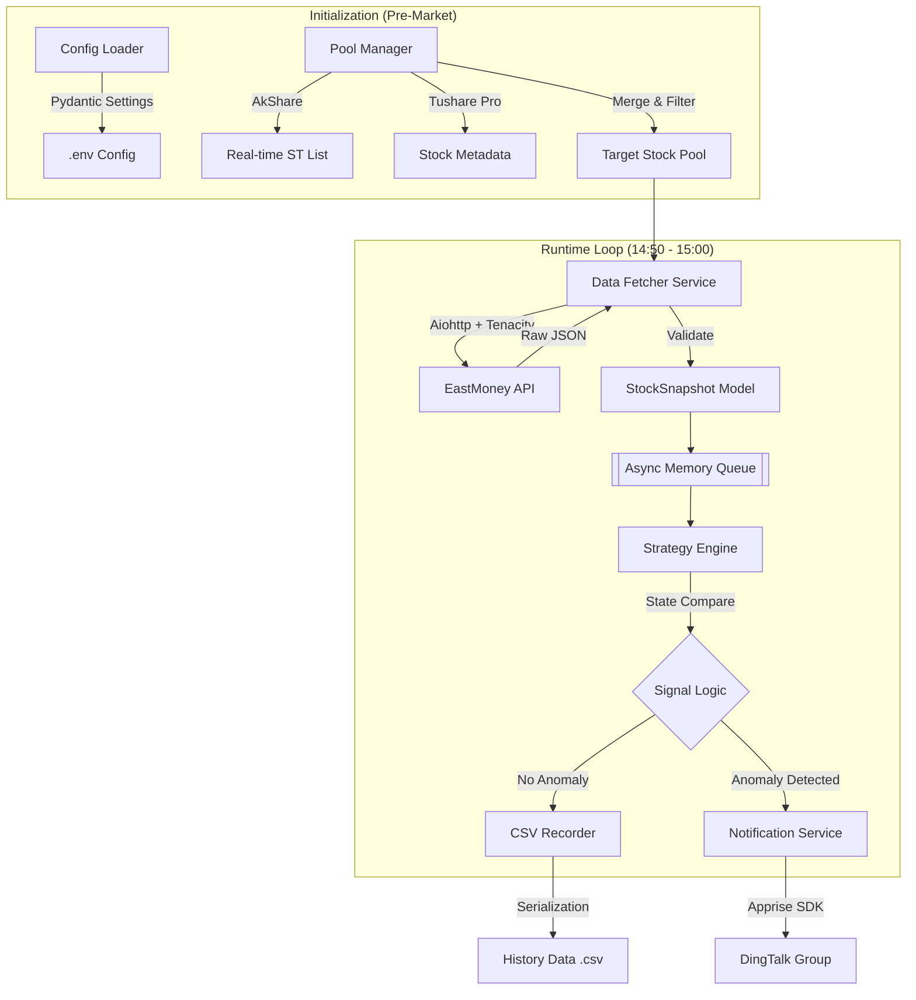

# Project Gutao_Chaodi: A股尾盘异动监控机器人系统架构与开发白皮书

| 文档编号 | GUTAO-DEV-WP-003 | 版本号 | v3.0 (Enterprise Edition) |
| --- | --- | --- | --- |
| **状态** | **已评审 (Approved)** | **最后更新** | 2026-02-17 |
| **适用对象** | 架构师, 后端开发工程师, 量化策略研究员 | **密级** | 内部公开 |

---

## 1. 项目概览 (Executive Summary)

### 1.1 业务背景

本项目旨在构建一套高频自动化监控系统，针对 A 股市场中的 **“跌停板尾盘翘板” (Limit-Down Open at Tail)** 交易策略进行实时信号捕捉。策略核心逻辑为：监控 T 日尾盘（14:50 - 15:00）跌停股封单的急剧变化（主力撤单或买入），以捕捉 T+1 日集合竞价的高溢价机会。

### 1.2 系统目标

* **低延迟 (Low Latency)**: 在尾盘关键 10 分钟内，实现对目标股票池的秒级轮询。
* **高可用 (High Availability)**: 具备网络抖动自动重试、异常熔断机制，确保盘中不宕机。
* **可回溯 (Traceability)**: 建立完整的数据录制机制，解决第三方数据源缺失历史 Tick 数据的痛点，为策略回测提供自有数据支撑。

---

## 2. 技术架构与选型论证 (Technology Stack)

为提升开发效率并确保系统健壮性，本项目严格遵循“避免重复造轮子”原则，引入成熟开源框架。以下是核心技术组件的选型决策矩阵。

### 2.1 核心组件决策表

| 架构层级 | 功能模块 | **选型方案** | **原始方案 (手动)** | **引入理由与核心价值** |
| --- | --- | --- | --- | --- |
| **数据接入层** | 实时 ST 列表 | **AkShare** | 手写爬虫解析网页 | **接口稳定性**: 封装了交易所/东方财富接口，直接返回清洗后的 DataFrame，无需维护爬虫反爬逻辑。 |
| **数据接入层** | 基础元数据 | **Tushare Pro** | (同上) | **数据标准化**: 即使 Tushare 实时性稍弱，但其提供的上市日期 (`list_date`) 等静态数据最为规范，用于过滤新股。 |
| **网络层** | 高并发请求 | **Aiohttp** | `Requests` (同步) | **异步 I/O**: 利用 Python `asyncio` 协程机制，实现单线程下的非阻塞高并发，满足秒级扫描 100+ 标的需求。 |
| **容错层** | 网络重试 | **Tenacity** | `try-except-sleep` | **弹性恢复**: 提供声明式的重试装饰器（指数退避算法），优雅处理网络超时和接口限流，代码零侵入。 |
| **领域模型层** | 数据校验 | **Pydantic** | 原生 Dict | **契约精神**: 强制定义数据输入输出格式，自动处理类型转换（如将 "-" 转为 0），防止脏数据污染策略逻辑。 |
| **基础设施** | 配置管理 | **Pydantic Settings** | `os.environ` | **环境隔离**: 支持 `.env` 文件加载，实现开发/生产环境配置分离，不仅读取配置，还负责校验配置是否存在。 |
| **可观测性** | 结构化日志 | **Loguru** | `print` + `colorama` | **运维友好**: 自动实现日志轮转（Rotation）、保留策略（Retention）和异常堆栈追踪，无需配置复杂的 Standard Logging。 |
| **通知网关** | 消息推送 | **Apprise** | `requests.post` | **统一接口**: 聚合了 80+ 种通知服务（钉钉、TG、邮件），解耦具体的推送实现，未来更换通知渠道无需修改核心代码。 |

---

## 3. 总体架构设计 (System Architecture)

系统采用 **“生产者-消费者” (Producer-Consumer)** 微内核架构，通过内存队列实现解耦。



---

## 4. 详细模块设计与实施规范

### 4.1 模块 A：配置与环境管理 (Infrastructure)

* **功能**: 统一管理 API Token、阈值参数、Webhook 地址。
* **依赖框架**: `pydantic-settings`
* **设计规范**: 禁止在代码中硬编码任何密钥或参数。
* **实施说明**:
通过定义 `Settings` 类，系统启动时会自动读取 `.env` 文件。如果缺少关键配置（如 Tushare Token），程序将直接报错启动失败，实现 Fail-fast。

```python
# 示例：通过类型注解强制规范配置格式
class Settings(BaseSettings):
    TUSHARE_TOKEN: str
    DINGTALK_URL: str
    VOL_DROP_THRESHOLD: float = 0.2  # 默认 20%
    
    class Config:
        env_file = ".env"

```

### 4.2 模块 B：股票池构建 (Pool Manager)

* **功能**: 每日开盘前生成当天的监控目标列表。
* **依赖框架**: `AkShare` (主), `Tushare` (辅), `Pandas`
* **数据融合逻辑**:
1. 调用 `ak.stock_zh_a_st_em()` 获取全市场实时 ST 股（AkShare 优势：实时性强，包含代码、名称、现价）。
2. 调用 `ts.pro_api().stock_basic()` 获取上市日期（Tushare 优势：静态数据准确）。
3. 利用 `Pandas` 进行 Inner Join，并执行过滤规则（上市 > 1年，非退市整理期）。

### 4.3 模块 C：抗网络抖动的数据采集 (Robust Fetcher)

* **功能**: 高频获取实时盘口快照。
* **依赖框架**: `aiohttp` (Client), `tenacity` (Retry)
* **设计规范**:
* **并发控制**: 使用 `asyncio.Semaphore` 限制并发数，防止触发 IP 封禁。
* **重试机制**: 使用 `@retry` 装饰器包裹请求函数。


* **实施说明**:
不需要在业务逻辑中编写 `try...except ConnectionError...sleep`。Tenacity 会自动处理：如果是网络超时，等待 0.5s 后重试；重试 3 次失败后抛出异常供上层记录。

```python
# 示例：声明式重试配置
@retry(stop=stop_after_attempt(3), wait=wait_fixed(0.5))
async def fetch_data(session, url):
    async with session.get(url) as resp:
        return await resp.json()

```

### 4.4 模块 D：领域数据模型 (Domain Model)

* **功能**: 数据清洗与标准化。
* **依赖框架**: `Pydantic`
* **设计规范**: 所有流入策略引擎的数据必须是 `StockSnapshot` 对象，严禁传递原生 Dict。
* **实施说明**:
API 返回的封单量可能是 `"-"` (表示无挂单) 或空字符串。Pydantic 的 `validator` 负责将其清洗为 `0` (int)，确保下游策略计算 `delta = vol_1 - vol_2` 时不会报错。

### 4.5 模块 E：通知网关 (Notification Gateway)

* **功能**: 多渠道消息分发。
* **依赖框架**: `Apprise`
* **设计规范**: 业务逻辑只调用 `send_alert(title, body)`，不关心底层是 HTTP Post 还是 SMTP。
* **实施说明**:
在配置文件中配置 URL 即可切换服务。例如：
* 钉钉: `dingtalk://token/`
* Telegram: `tgram://bot_token/chat_id`
代码无需变动。

---

## 5. 数据治理与策略验证 (Data Strategy & Validation)

由于本策略依赖 **Level-1 盘口委托量 (Order Book Ask Volume)** 的瞬时变化，常规 K 线数据无法支撑回测。鉴于本地维护 TB 级历史 Tick 数据成本过高，本项目采用 **“云端回测 + 本地实盘”** 的双轨制研发模式。

### 5.1 历史策略验证 (Cloud Backtesting)

为验证“跌停板翘板”逻辑的有效性并优化阈值参数（如：封单减少多少比例算有效？），我们**不建议本地下载数据**，而是利用成熟量化平台的免费算力与数据。

* **推荐平台**: **聚宽 (JoinQuant)** 或 **米筐 (RiceQuant)**。
* **数据优势**: 这些平台提供历史 **Tick 快照** 或 **包含盘口信息的分钟线**，能够查询到历史任意时刻的 `ask_v1` (卖一量)。
* **验证流程**:
1. **注册/登录**: 使用聚宽/米筐的研究环境 (Jupyter Notebook)。
2. **编写验证脚本**:
* 筛选出历史上的 ST 跌停股。
* 调用平台 API 获取其 14:50 - 15:00 的 `tick` 数据。
* 分析 `current_tick.ask_volume_1` 的变化斜率。


3. **产出结论**: 确定最佳参数（例如：`VOL_DROP_THRESHOLD = 0.3` 表示封单减少 30% 胜率最高）。


> **代码示例 (伪代码 - 聚宽环境):**


> ```python
> # 在聚宽研究环境中运行
> df = get_ticks('600xxx.XSHG', start_dt='2024-01-01 14:50:00', end_dt='2024-01-01 15:00:00', 
>                fields=['time', 'current', 'a1_v']) # a1_v 即卖一量
> # 分析 df['a1_v'] 的下降趋势...
> 
> ```
> 
> 

### 5.2 仿真与实盘数据 (Paper Trading & Live)

本地 WSL2 环境仅用于**实盘阶段**，不再承担繁重的历史数据清洗任务。

* **数据来源**: 东方财富 HTTP 接口 (EastMoney)。
* **数据流转**:
* **Tushare/AkShare**: 每日 09:00 初始化股票池。
* **EastMoney API**: 每日 14:50 - 15:00 轮询实时快照。


* **参数注入**: 将在云端回测确定的参数（如阈值、时间窗口）写入本地 `.env` 配置文件。

### 5.3 数据来源一致性说明

| 阶段 | 数据提供方 | 数据类型 | 作用 |
| --- | --- | --- | --- |
| **策略研发 (回测)** | **JoinQuant/RiceQuant** | **Historical Tick** | 验证逻辑，确定参数，无需下载数据。 |
| **实盘监控 (生产)** | **EastMoney (via Aiohttp)** | **Real-time Snapshot** | 实时捕捉信号，发送钉钉通知。 |
| **每日选股** | **AkShare** | **Real-time List** | 生成当日监控目标池。 |

---

## 6. 开发计划与里程碑 (Revised)

| 阶段 | 任务名称 | 关键产出 | 涉及工具 |
| --- | --- | --- | --- |
| **Phase 1** | **云端策略验证** | **策略参数报告** (确定阈值参数) | JoinQuant (Web) |
| **Phase 2** | **基础环境构建** | `config.py`, `models.py` | Pydantic |
| **Phase 3** | **股票池管理** | `pool_manager.py` | AkShare |
| **Phase 4** | **高并发采集** | `fetcher.py` (含重试机制) | Aiohttp, Tenacity |
| **Phase 5** | **实盘引擎集成** | `engine.py`, `notifier.py` | Loguru, Apprise |

---

## 7. 附录：环境依赖清单 (requirements.txt)

```text
pydantic
pydantic-settings
aiohttp
tenacity
loguru
apprise
akshare
tushare
pandas
python-dotenv
```
